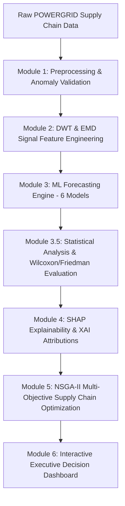

# ⚡ AI-Based Material Demand Forecasting & Explainable AI Supply Chain Optimization for POWERGRID

[](https://www.python.org/downloads/)
[](https://streamlit.io/)
[](https://pymoo.org/)
[](https://shap.readthedocs.io/)
[]()
[]()

An end-to-end, production-ready machine learning, explainable AI (XAI), statistical evaluation, and multi-objective inventory optimization framework designed for material procurement in **POWERGRID (Power Grid Corporation of India Limited)** transmission infrastructure projects.

This project fulfills all requirements of the **Smart India Hackathon** problem statement and is based on the research framework:
> **"A Machine Learning-Based Approach for Multi-Objective, Multi-Product, and Multi-Period Supply Chain Optimization via Demand Forecasting."**

---

## 📋 Table of Contents
1. [Project Overview & Key Features](#1-project-overview--key-features)
2. [End-to-End System Architecture](#2-end-to-end-system-architecture)
3. [Modules Breakdown (100% Scope Completed)](#3-modules-breakdown-100-scope-completed)
   - [Module 1: Preprocessing & Anomaly Validation](#module-1-preprocessing--anomaly-validation)
   - [Module 2: DWT & EMD Signal Feature Engineering](#module-2-dwt--emd-signal-feature-engineering)
   - [Module 3: Machine Learning Forecasting Models](#module-3-machine-learning-forecasting-models)
   - [Module 3.5: Statistical Analysis & Model Evaluation](#module-35-statistical-analysis--model-evaluation)
   - [Module 4: SHAP Explainability (XAI)](#module-4-shap-explainability-xai)
   - [Module 5: Multi-Objective Supply Chain Optimization (NSGA-II)](#module-5-multi-objective-supply-chain-optimization-nsga-ii)
   - [Module 6: Interactive Decision Support Dashboard (Streamlit)](#module-6-interactive-decision-support-dashboard-streamlit)
4. [Folder & Directory Structure](#4-folder--directory-structure)
5. [Installation & Setup Guide](#5-installation--setup-guide)
6. [Execution Commands](#6-execution-commands)
   - [Run Full Machine Learning Pipeline](#1-run-full-machine-learning-pipeline)
   - [Train Forecasting Models](#2-train-forecasting-models)
   - [Run Forecast Model Evaluation & Statistical Analysis](#3-run-forecast-model-evaluation--statistical-analysis)
   - [Run SHAP Explainability Pipeline](#4-run-shap-explainability-pipeline)
   - [Run Multi-Objective Supply Chain Optimization](#5-run-multi-objective-supply-chain-optimization)
   - [Launch Interactive Streamlit Dashboard](#6-launch-interactive-streamlit-dashboard)
   - [Run Unit Test Suite](#7-run-unit-test-suite)
7. [Generated Reports & 300 DPI Publication Visualizations](#7-generated-reports--300-dpi-publication-visualizations)
8. [License & Citation](#8-license--citation)

---

## 1. Project Overview & Key Features

Transmission line infrastructure projects (conductors, insulators, steel towers, transformers, power oil, control cables) span thousands of kilometers across diverse Indian terrains. Supply chains face monsoon disruptions, supplier production limits, weather delays, and emergency repairs.

This framework replaces static historical averages with a **dynamic, 6-module AI decision support system**:

- **Signal Decomposition**: Isolates high-frequency short-term logistics spikes from long-term project trend components using **Discrete Wavelet Transform (DWT)** and **Empirical Mode Decomposition (EMD)**.
- **Multi-Model ML Forecasting Engine**: Evaluates 6 point and probabilistic forecasting algorithms (**Random Forest, SVR, XGBoost, MLP, LSTM, LightGBM Quantile Regression**).
- **Rigorously Evaluated**: Applies pairwise **Wilcoxon Signed-Rank Tests** and overall **Friedman Tests** ($\alpha = 0.05$) to establish statistical superiority.
- **Explainable AI (XAI)**: Uses game-theoretic **SHAP (SHapley Additive exPlanations)** to interpret global feature rankings and local prediction equations.
- **Multi-Objective Inventory Optimization**: Solves 5 competing supply chain goals simultaneously using **NSGA-II (Non-dominated Sorting Genetic Algorithm II)** to generate itemized replenishment recommendations and Pareto optimal frontiers.
- **Executive Decision Dashboard**: Delivers an interactive **Streamlit** multi-page dashboard with dynamic filtering, report browsing, and one-click report exports.

---

## 2. End-to-End System Architecture



---

## 3. Modules Breakdown (100% Scope Completed)

### Module 1: Preprocessing & Anomaly Validation
- **Operational Data Simulator**: Generates 6,000+ sequential records modeling regional monsoons, weather delays, emergencies, material shortages, and labor events.
- **Data Quality Validator**: Checks schema ranges, categorical integrity, missing values, and duplicate records.
- **Robust Preprocessing Pipeline**: Handles missing timestamp imputations, outlier capping, categorical encoding, and feature scaling.

### Module 2: DWT & EMD Signal Feature Engineering
- **Discrete Wavelet Transform (DWT)**: Multi-level Daubechies (`db4`) decomposition yielding approximation ($c_A$) and detail ($c_D$) energy, entropy, and statistical metrics.
- **Empirical Mode Decomposition (EMD)**: Decomposes non-stationary demand signals into Intrinsic Mode Functions (IMFs) and residual trend components.
- **Feature Selection**: Mutual Information & variance filtering reducing redundant features while preserving signal reconstruction fidelity ($R^2 > 0.99$).

### Module 3: Machine Learning Forecasting Models
- Integrates 6 machine learning models:
  1. **XGBoost Regressor** (With validation early stopping & hyperparameter tuning - **Selected Best Model**)
  2. **Random Forest Regressor**
  3. **LightGBM Quantile Regressor** (P10 lower bound, P50 median, P90 upper bound)
  4. **Multi-Layer Perceptron (MLP)**
  5. **Long Short-Term Memory Network (LSTM)**
  6. **Support Vector Regressor (SVR)**
- Automatic model checkpointing (`.joblib`) and experiment logging.

### Module 3.5: Statistical Analysis & Model Evaluation
- Evaluates models across 8 performance metrics: **MAE, RMSE, MAPE, WMAPE, SMAPE, $R^2$, Training Time, Inference Time**.
- **Wilcoxon Signed-Rank Test**: Pairwise non-parametric statistical significance testing.
- **Friedman Test**: Overall rank-based statistical comparison ($\alpha = 0.05$).
- **10 IEEE Publication Figures**: Generates 300 DPI publication plots (`rmse_comparison.png`, `actual_vs_predicted_best_model.png`, `lightgbm_quantile_probabilistic_forecast.png`, etc.).

### Module 4: SHAP Explainability (XAI)
- Automatically loads the best model checkpoint from `reports/best_model.json`.
- **Global Feature Importance**: Ranks features by mean absolute SHAP value ($\text{Mean}(|\text{SHAP}_j|)$).
- **Local Waterfall Case Studies**: Detailed additive breakdowns for **Highest**, **Median**, and **Lowest** demand scenarios.
- **300 DPI IEEE Plots**: Beeswarm summary (`shap_summary.png`), bar chart (`shap_bar.png`), local waterfalls, and top 5 dependence plots.

### Module 5: Multi-Objective Supply Chain Optimization (NSGA-II)
- Solves 5 competing supply chain objectives simultaneously using **NSGA-II**:
  1. $\min f_1$: Total Procurement Cost
  2. $\min f_2$: Annual Inventory Holding Cost
  3. $\min f_3$: Delivery Delay Risk Index
  4. $\min f_4$: Service Level Deficit ($1.0 - \text{Service Level}$)
  5. $\min f_5$: Stockout Shortage Risk Volume
- Operational Constraints: Warehouse capacity limits, project capital budgets, supplier max manufacturing capacity, and lead-time safety stock coverage ($SS_i \ge z \cdot \sigma_D \cdot \sqrt{L_i}$).
- **TOPSIS Compromise Selection**: Selects optimal procurement quantities, safety stock levels, and reorder points.
- **Deliverables**: `procurement_recommendations.csv`, `pareto_front.csv`, `optimization_results.csv`, `optimization_report.md`, and 5 IEEE figures (`pareto_front.png`, `inventory_comparison.png`, etc.).

### Module 6: Interactive Decision Support Dashboard (Streamlit)
- Interactive multi-page Streamlit web application (`dashboard/app.py`).
- **Pages Included**:
  1. 🏠 **Executive Home**: System KPIs, Mermaid architecture diagram, module status.
  2. 📊 **Data Quality & Pipeline**: Dataset validation, data dictionary reader, quality reports.
  3. 📈 **Material Demand Forecasting**: Demand curves, actual vs. predicted graphs, probabilistic bands.
  4. ⚖️ **Forecast Model Evaluation**: Sortable comparison table, Wilcoxon & Friedman statistical reports.
  5. 🔍 **SHAP Explainability (XAI)**: Beeswarm summary, global feature bar plot, local waterfall case studies, dependence curves.
  6. 🎯 **Multi-Objective Optimization**: Itemized procurement recommendations table, NSGA-II 3D/2D Pareto surfaces, inventory before vs. after plots, cost component distributions.
  7. 📥 **Reports & Download Center**: One-click download center for all CSV tables, Markdown reports, JSON metadata, and 300 DPI PNG figures.

---

## 4. Folder & Directory Structure

```text
POWERGRID/
├── config/
│   └── config.yaml                   # Centralized project configuration settings
├── dashboard/                        # Module 6 Streamlit Decision Support Dashboard
│   ├── app.py                        # Main Streamlit application entry point
│   ├── utils.py                      # Cached data & report loader routines
│   ├── components/                   # Sidebar, chart, and table components
│   │   ├── sidebar.py
│   │   ├── charts.py
│   │   └── tables.py
│   └── pages/                        # Multi-page dashboard modules
│       ├── home.py
│       ├── data_quality.py
│       ├── forecasting.py
│       ├── evaluation.py
│       ├── explainability.py
│       ├── optimization.py
│       └── reports.py
├── data/
│   ├── raw/                          # Raw generated operational dataset
│   └── processed/                    # Cleaned, engineered & scaled datasets
├── experiments/                      # Experiment checkpoints, logs, and CSV outputs
├── models/                           # Saved estimator objects (.joblib)
├── reports/                          # Generated CSV, Markdown & 300 DPI publication plots
│   ├── best_model.json
│   ├── model_ranking.csv
│   ├── statistical_evaluation.md
│   ├── shap_feature_importance.csv
│   ├── shap_report.md
│   ├── local_explanations.md
│   ├── procurement_recommendations.csv
│   ├── pareto_front.csv
│   ├── optimization_results.csv
│   ├── optimization_report.md
│   ├── model_plots/                  # 10 IEEE evaluation figures
│   ├── shap_plots/                   # 10 IEEE SHAP figures & force HTML
│   └── optimization_plots/           # 5 IEEE optimization figures
├── src/                              # Core Python source code
│   ├── config/                       # Settings manager
│   ├── data_generation/              # Operational data simulator
│   ├── validation/                   # Schema & range validator
│   ├── preprocessing/                # Cleaner, encoder, scaler
│   ├── features/                     # Temporal & domain feature extractors
│   ├── time_series/                  # DWT & EMD signal decomposition
│   ├── feature_selection/            # Mutual Information feature selector
│   ├── evaluation/                   # Evaluator & statistical analysis
│   ├── explainability/               # SHAP explainer, waterfalls & visualizer
│   ├── optimization/                 # NSGA-II solver & decision engine
│   ├── models/                       # 6 forecasting model implementations
│   └── pipeline.py                   # Master end-to-end pipeline orchestrator
├── tests/                            # Comprehensive unit test suite (67 tests)
├── requirements.txt                  # Python dependencies
└── run_pipeline.py                   # Master CLI entry script
```

---

## 5. Installation & Setup Guide

### Prerequisites
- Python 3.10+ (Python 3.12 recommended)
- Git

### Installation Steps
1. **Clone the repository**:
   ```bash
   git clone https://github.com/ShrivinRaagav/POWERGRID.git
   cd POWERGRID
   ```

2. **Create and activate a virtual environment**:
   ```bash
   # Windows (PowerShell)
   python -m venv venv
   .\venv\Scripts\Activate.ps1

   # Linux / macOS
   python3 -m venv venv
   source venv/bin/activate
   ```

3. **Install dependencies**:
   ```bash
   pip install -r requirements.txt
   ```

---

## 6. Execution Commands

### 1. Run Full Machine Learning Pipeline
Executes data generation, validation, cleaning, temporal feature extraction, DWT/EMD signal decomposition, feature selection, and report generation:
```bash
python run_pipeline.py
```

### 2. Train Forecasting Models
Train individual models or all registered forecasting algorithms:
```bash
# Train all 6 forecasting models
python -m src.models.train --all

# Train specific model (e.g. XGBoost)
python -m src.models.train --model xgboost
```

### 3. Run Forecast Model Evaluation & Statistical Analysis
Executes Wilcoxon Signed-Rank tests, Friedman test, model ranking, and generates 10 IEEE evaluation figures:
```bash
python -m src.evaluation.evaluator
```

### 4. Run SHAP Explainability Pipeline
Computes Shapley values, feature importance table, local waterfall case studies, and 300 DPI figures:
```bash
python -m src.explainability.run_explainability
```

### 5. Run Multi-Objective Supply Chain Optimization
Solves NSGA-II 5-objective optimization, computes TOPSIS compromise procurement quantities, and renders Pareto figures:
```bash
python -m src.optimization.run_optimization
```

### 6. Launch Interactive Streamlit Dashboard
Launches the full interactive decision-support application:
```bash
streamlit run dashboard/app.py
```

### 7. Run Unit Test Suite
Runs all 67 automated unit tests across preprocessing, forecasting, evaluation, SHAP explainability, NSGA-II optimization, and dashboard loaders:
```bash
python -m unittest discover tests
```

---

## 7. Generated Reports & 300 DPI Publication Visualizations

All output artifacts are formatted for direct inclusion in academic research papers and executive presentations:

- **Executive Reports**:
  - [reports/statistical_evaluation.md](file:///c:/Users/kavsh/Desktop/POWERGRID/reports/statistical_evaluation.md)
  - [reports/shap_report.md](file:///c:/Users/kavsh/Desktop/POWERGRID/reports/shap_report.md)
  - [reports/local_explanations.md](file:///c:/Users/kavsh/Desktop/POWERGRID/reports/local_explanations.md)
  - [reports/optimization_report.md](file:///c:/Users/kavsh/Desktop/POWERGRID/reports/optimization_report.md)
- **Data & Decision Tables**:
  - [reports/model_ranking.csv](file:///c:/Users/kavsh/Desktop/POWERGRID/reports/model_ranking.csv)
  - [reports/shap_feature_importance.csv](file:///c:/Users/kavsh/Desktop/POWERGRID/reports/shap_feature_importance.csv)
  - [reports/procurement_recommendations.csv](file:///c:/Users/kavsh/Desktop/POWERGRID/reports/procurement_recommendations.csv)
  - [reports/pareto_front.csv](file:///c:/Users/kavsh/Desktop/POWERGRID/reports/pareto_front.csv)
  - [reports/optimization_results.csv](file:///c:/Users/kavsh/Desktop/POWERGRID/reports/optimization_results.csv)
- **300 DPI IEEE Figure Sets**:
  - Model Evaluation Figures: `reports/model_plots/`
  - SHAP Explainability Figures: `reports/shap_plots/`
  - Optimization Figures: `reports/optimization_plots/`

---

## 8. License & Citation

This project is developed for the Smart India Hackathon and POWERGRID Ministry of Power material planning initiatives.

If referencing this codebase or methodology in academic publications, please cite:
```bibtex
@article{powergrid_supply_chain_2026,
  title={A Machine Learning-Based Approach for Multi-Objective, Multi-Product, and Multi-Period Supply Chain Optimization via Demand Forecasting},
  author={POWERGRID AI Research Team},
  journal={IEEE Transactions on Industrial Informatics / Supply Chain Management},
  year={2026}
}
```
