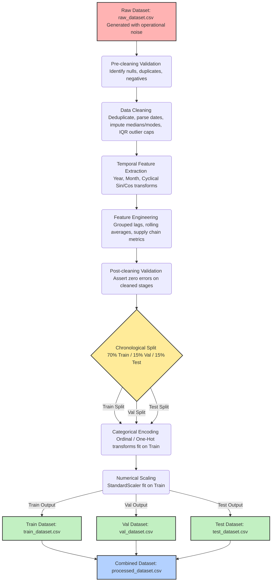

# POWERGRID Preprocessing Pipeline - Visual Diagram

Below is the conceptual flowchart illustrating the sequential data preparation stages:

```
POWERGRID Dataset
        │
        ▼
Data Validation
        │
        ▼
Data Cleaning
        │
        ▼
Feature Engineering
        │
        ▼
Feature Summary
        │
        ▼
Processed Dataset
```

---

## Detailed Preprocessing Pipeline Sequence

The complete processing workflow, including validation check loops and sequential data splits:


